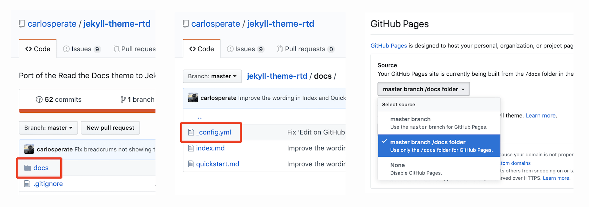

# 🚀 Quick Start With GitHub Pages Version 1

There are several ways to configure the
[GitHub Pages publishing source](https://help.github.com/en/github/working-with-github-pages/configuring-a-publishing-source-for-your-github-pages-site),
I would recommend to use the `docs` folder option, as you can keep source code
and documentation together in the master branch.

With that in mind, there are only three steps required to get your docs up an
running with this theme:

1. Add your documentation markdown files into a docs folder at the root of your
  repository.
1. Add to the docs folder a `_config.yml` file with this line: 
  `remote_theme: carlosperate/jekyll-theme-rtd`
1. Select your publishing source in the GitHub repository settings as indicated
  in [the official documentation](https://help.github.com/en/github/working-with-github-pages/configuring-a-publishing-source-for-your-github-pages-site).

And that's it!

There are more configuration options explained in the rest of this theme
documentation, or if you prefer it you can have a look at the
[_config.yml file used to generate this website](https://github.com/carlosperate/jekyll-theme-rtd/blob/master/docs/_config.yml).
